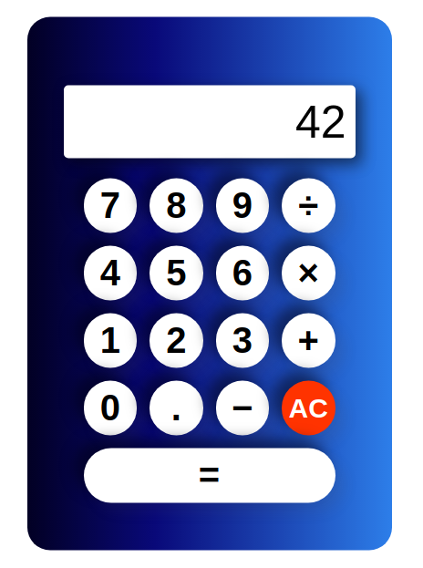

# Simple Calculator Project

I wanted to bring together HTML, CSS and JS to create a simple program as this calculator that can do the following: 

* accepts user inputs of number, operator and another number
* accepts decimal numbers
* stores inputs and previous total
* perform calculations and return result
* should prevent invalid inputs like 2 consecutive operators
* display all input being entered
* All Clear button to reset inputs

**Link to project:** https://brianbud.github.io/calculator/

## How It's Made: 

**Tech used:** HTML, CSS and JavaScript

## Lessons Learned:

Going through this project I learnt a ton such as: 

* Flexbox to create the layout such as flex-wrap for the buttons and understanding flex-grow.
* Using rems instead of px to create a more responsive layout.
* Using querySelectors and AddEventListener to run functions.
* Creating objects and constructor Functions.
* Using Switch Conditions instead of if/else statements.
* Object Destructuring.
* Learning why using Function() might be more preferred than using eval() to perform calculations. 
